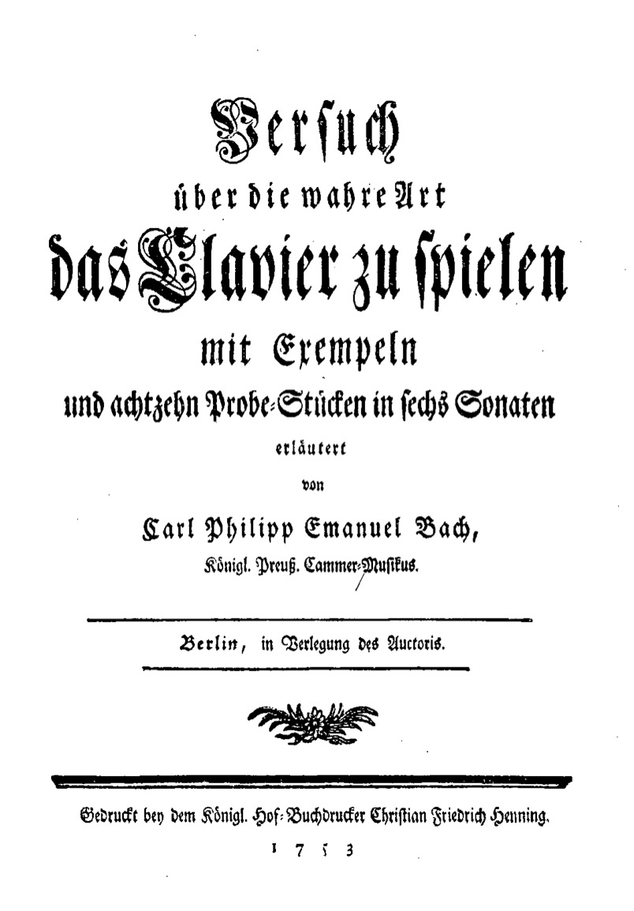

Titelblatt
===================================================

.. rubric:: Versuch über die wahre Art Das Clavier zu spielen 

mit Exempeln und achtzehn Probe-Stücken in 6 Sonaten erläutert
von
Carl Philipp Emanuel Bach, 
königl. Preuß. Cammer-Musikus.

Berlin, in Verlegung des Autors. 

Gedruckt bei dem königl. Hof-Buchdrucker Christian Friedrich Henning. 

1753