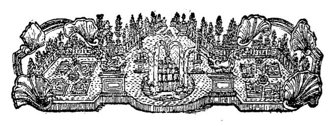

************************
Vorrede
************************

So viele Vorzüge das Klavier besitzet, so vielen Schwierigkeiten ist dasselbe zu gleicher Zeit unterworfen. Die Vollkommenheit desselben wäre leichte daraus zu erweisen, wenn es nötig wäre, weil es diejenigen Eigenschaften, die andere Instrumente nur einzeln haben, in sich vereinet; weil man eine vollständige Harmonie, wozu sonst drei, vier und mehrere Instrumente erfordert werden, darauf mit einmal hervor bringen kann, und was dergleichen Vorteile mehr sind.

.. index::
    single: Klavierspiel; Anforderungen

Wem ist aber nicht zugleich bekannt, wie viele Forderungen an das Klavier gemacht werden; wie man sich nicht begnüget, dasjenige von einem Klavierspieler zu erwarten, was man von jedem Instrumentesten mit Recht fordern kann, nämlich die Fertigkeit, ein für sein Instrument gesetztes Stück den Regeln des guten Vortrags gemäß, auszuführen? Man verlanget noch überdies, daß ein Klavierspieler Fantasien von allerlei Art machen soll; daß er einen aufgegebenen Satz nach den strengsten Regeln der Harmonie und Melodie aus dem Stegreif durcharbeiten, aus allen Tönen mit gleicher Leichtigkeit spielen, einen Ton in den anderen im Augenblick ohne Fehler übersetzen, alles ohne Unterschied vom Blatte weg spielen soll, es mag für sein Instrument eigentlich gesetzt sein oder nicht; daß er die Wissenschaft des Generalbasses in seiner völligen Gewalt haben, selbigen mit Unterschied, oft mit Verleugnung, bald mit vielen, bald mit wenigen Stimmen, bald nach der Strenge der Harmonie, bald galant, bald nach einem zu wenig oder zu viel, bald gar nicht und bald sehr falsch bezifferten Basse spielen soll; daß er diesen Generalbaß manchmal aus Partituren von vielen Linien, bei unbezifferten, oder ofte gar pausierenden Bässen, wenn nämlich eine von den anderen Stimmen zum Grunde der Harmonie dient, ziehen und dadurch die Zusammenstimmung verstärken soll, und wer weiß alle Forderungen mehr?

Diesem soll nun noch mehrenteils auf einem fremden Instrumente Genüge geschehen, und sieht man gar nicht darauf, ob solches gut oder schlecht, ob solches im gehörigen Stande ist, oder nicht, wobei oft keine Entschuldigung gilt. Im Gegenteile ist dieses die gewöhnlichste Zumutung, daß man Fantasien verlangt, ohne sich zu bekümmern, ob der Klavierist in dem Augenblicke dazu genugsam aufgeräumt ist oder nicht, und ohne ihm die dazu gehörige Disposition, entweder durch Darbietung eines tüchtigen Instruments zu verschaffen, oder ihm selbige zu erhalten.

Dieser Forderungen ungeachtet findet das Klavier allezeit mit Recht seine Liebhaber. Man lässt sich durch die Schwierigkeit desselben nicht abschrecken, ein Instrument zu erlernen, welches durch seine vorzüglichen Reize die darauf gewandte Mühe und Zeit völlig ersetzet. Es ist aber auch nicht jeder Liebhaber verbunden, alle diese Forderungen an dasselbe zu erfüllen. Er nimmt so vielen Anteil daran, als er will, und ihm die von Natur erhaltenen Gaben erlauben.

.. index::
    single: Abhören

Nur wäre es zu wünschen, daß die Unterweisung auf diesem Instrumente hin und wieder etwas verbessert, und das wahre Gute, welches, wie überhaupt in der Musik, also besonders auf dem Klaviere noch bisher bei wenigen anzutreffen gewesen ist, dadurch allgemeiner würde. Die vortrefflichsten Meister in der Ausübung, denen man etwas Gutes abhören könnte, sind noch nicht in so großer Anzahl zu finden, als man sich vielleicht einbilden dürfte. Das Abhören, eine Art erlaubten Diebstahls, aber ist in der Musik desto notwendiger, da, wenn auch die Abgunst unter den Menschen nicht so groß wäre, viele Sachen aufstoßen, die man kaum weisen, geschweige schreiben kann, und die man also vom bloßen Hören erlernen muß.

Wenn ich hiermit der Welt eine Anleitung zum Klavierspielen übergebe: So ist meine Absicht im geringsten nicht, die vorher angeführten Anforderungen an dasselbe nach einander durchzugehen, und zu zeigen, wie man allen diesen besonders ein Genüge leisten soll. Es wird hier weder von der Art zu fantasieren, noch von dem Generalbasse gehandelt werden. Man findet dieses zum Teil in vielen guten Büchern bereits vorlängst ausgeführt. Ich bin hier Willens, die wahre Art zu zeigen, Handsachen mit Beifall vernünftiger Kenner zu spielen. Wer aber hierinnen das Seinige getan hat, der hat schon sehr vieles auf dem Klaviere getan, und wird derselbe in den übrigen Aufgaben desselben desto bequemer fortzukommen, die Fähigkeit haben. 

Die Anforderungen, die man vor allen anderen Instrumenten vorzüglich an das Klavier macht, zeugen von der Vollkommenheit und dem weiten Umfange desselben, und aus der musikalischen Geschichte bemerket man, daß diejenigen, denen es gelungen, sich einen großen Namen in der musikalischen Welt zu machen, dieses Instrument mehrenteils vorzüglich ausgeübt haben.

Bei allem diesen habe ich hauptsächlich meine Absicht zugleich auf diejenigen Lehrer gerichtet, welche ihre Schüler bisher nicht nach den wahren Grundsätzen der Kunst angeführt haben. Liebhaber, die durch falsche Vorschriften verhudelt worden, können sich von selbst nach meinen Lehrsätzen zurechte helfen, wenn sie schon viel Musik sonsten gespielt haben; Anfänger aber werden, vermittels derselben, mit besonderer Leichtigkeit in kurzer Zeit dahin kommen, wo sie kaum geglaubt hätten.

Diejenigen irren sich, welche ein weitläufiges Lehrgebäude von mir erwartet haben; ich habe mehr Dank zu verdienen geglaubt, wenn ich das ziemlich schwere Klavier-Studium durch kurze Lehrsätze, so viel möglich, leichte und angenehm machte.

Indem ich unterschiedene Wahrheiten mehr als einmal zu erwähnen genötigt worden bin, teils wegen der Gelegenheit, welche solches erfordert hat, teils um das viele Nachschlagen zu vermeiden, teils weil ich glaube, daß man gewisse Hauptsätze nicht zu oft einschärfen kann: so hoffe ich diesfalls eben so wohl bei meinen Lesern Vergebung zu erhalten, als deswegen, daß sich vielleicht mancher durch die Wahrheit getroffen finden wird, ohne daß ich gleichwohl die geringste Absicht einer persönlichen Beleidigung gehabt habe.

Sollte gegenwärtiges Werk bei vernünftigen Kennern einigen Beifall finden: so würde ich dadurch angereizt werden, dasselbe mit der Zeit, vermittels einiger Beiträge, fortzusetzen.
