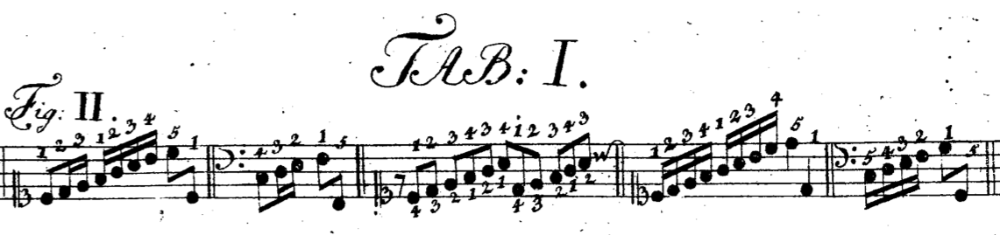
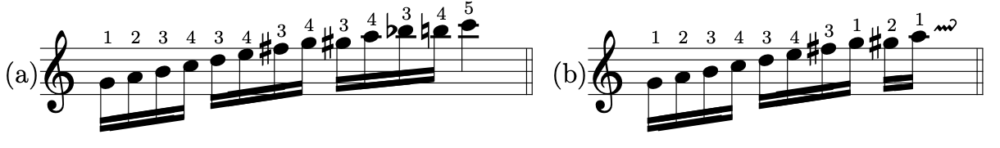

************************************************
Das erste Hauptstück. Von der Fingersetzung
************************************************

.. rubric:: §1 

Die Setzung der Finger ist bei den allermeisten Instrumenten durch die natürliche Beschaffenheit derselben gewissermaßen festgesetzt: bei dem Klaviere aber scheint sie am willkürlichsten zu sein, indem die Lage der Tasten so beschaffen ist, dass sie von jedem Finger niedergedrückt werden können. 

.. index::
    single: Fingersetzung; Grundlagen

.. rubric:: §2

Da nichts destoweniger nur eine Art des Gebrauchs der Finger bei dem Klaviere gut ist, und wenige Fälle in Betrachtung der übrigen mehr als eine Applicatur erlauben; da jeder neue Gedanke beinahe eine neue und eigene Fingersetzung erfordert, welche oft durch die bloße Verbindung eines Gedankens mit den anderen wieder verändert wird; da die Vollkommenheit des Klaviers eine unerschöpfliche Menge von Möglichkeiten vorzüglich darbietet; da endlich der echte Gebrauch der Finger bisher so unbekannt gewesen und nach Art der Geheimnisse nur unter wenigen geblieben ist, so hat es nicht fehlen können, dass die allermeisten auf diesem schlüpfrigen und verführerischen Wege haben irren müssen. 

.. rubric:: §3

Dieser Irrtum ist um so viel beträchtlicher, je weniger man ihn oft hat merken können, indem auf dem Klavier das meiste auch mit einer falschen Applicatur, obschon mit entsetzlicher Mühe und ungeschickt, herausgebracht werden kann, anstatt dass bei anderen Instrumenten die geringste falsche Fingersetzung sich mehrenteils durch die bloße Unmöglichkeit, das vorgeschriebene zu spielen, entdeckt. 
Man hat daher alles der Schwierigkeit des Instruments und der dafür gesetzten Stücke so gleich zugeschrieben und geglaubt, es müsse so und könne nicht anders sein.

.. index::
    single: Fingersetzung; Notwendigkeit

.. rubric:: §4
    
Da man hieraus erkennen kann, dass der rechte Gebrauch der Finger einen unzertrennlichen Zusammenhang mit der ganzen Spielart hat, so verliert man bei einer unrichtigen Fingersetzung mehr als man durch alle mögliche Kunst und guten Geschmack ersetzen kann. 
Die ganze Fertigkeit hängt hiervon ab, und man kann aus der Erfahrung beweisen, dass ein mittelmäßiger Kopf mit gut gewöhnten Fingern allezeit den größten Musicum im Spielen übertreffen wird, wenn dieser letztere wegen seiner falschen Applicatur gezwungen ist, wider seine Überzeugung sich hören zu lassen. 

.. rubric:: §5
    
Aus dem Grunde, dass jeder neue Gedanke beinahe seine eigene Fingersetzung habe, folgt, dass die jetzige Art zu denken, indem sie sich von der in vorherigen Zeiten ganz besonders unterscheidet, eine neue Applicatur eingeführt habe. 

.. rubric:: §6

Unsere Vorfahren, welche sich überhaupt mehr mit der Harmonie als der Melodie abgaben, spielten folglich auch meistenteils vollstimmig.
Wir werden aus der Folge ersehen, dass bei dergleichen Gedanken, indem man sie meistenteils nur auf eine Art herausbringen kann, und sie nicht so gar viel Veränderungen haben, jedem Finger seine Stelle gleichsam angewiesen ist; 
folglich sind sie nicht so verführerisch wie die melodischen Passagien, weil der Gebrauch der Finger bei diesen letzteren viel willkürlicher ist, als bei jenen. 
Vor diesem war das Klavier nicht so gut temperiert wie heute zu Tage, folglich brauchte man nicht alle 24 Tonarten wie jetzt und man hatte also auch nicht die Verschiedenheit von Passagien.

.. index::
    single: Daumen; Spiel ohne
    single: Daumen

.. rubric:: §7
    
Überhaupt sehen wir hieraus, dass man bei jetzigen Zeiten ganz und gar nicht ohne die rechten Finger geschickt fortkommen kann, da es noch eher vordem anging. 
Mein seliger Vater hat mir erzählt, in seiner Jugend große Männer gehört zu haben, welche den Daumen nicht eher gebrauchten, als wenn es bei großen Spannungen nötig war. 
Da er nun einen Zeitraum erlebt hatte, in welchem nach und nach eine ganz besondere Veränderung mit dem musikalischen Geschmack vorging: so wurde er dadurch genötigt, einen weit vollkommeneren Gebrauch der Finger sich anzueignen, besonders den Daumen, welcher außer anderen guten Diensten hauptsächlich in den schweren Tonarten ganz unentbehrlich ist, so zu gebrauchen, wie ihn die Natur gleichsam gebraucht wissen will. 
Hierdurch ist er auf einmal von seiner bisherigen Untätigkeit zu der Stelle des Hauptfingers erhoben worden.

.. rubric:: §8
    
Da diese neue Fingersetzung so beschaffen ist, dass man damit alles mögliche zur bestimmten Zeit leicht herausbringen kann; so lege ich solche hier zum Grunde. 

.. rubric:: §9

Es ist nötig, bevor ich an die Lehre der Applicatur selbst gehe, vorher gewisse Dinge zu erinnern, welche man teils vorher wissen muss, teils von der Wichtigkeit sind, dass ohne sie auch die besten Regeln unkräftig bleiben würden.

.. rubric:: §10
    
Ein Clavierist muss mitten vor der Tastatur sitzen, damit er mit gleicher Leichtigkeit sowohl die höchsten als tiefsten Töne anschlagen könne.

.. index::
    single: Sitzhöhe

.. rubric:: §11
    
Hängt der Vorderteil des Armes etwas weniges nach dem Griffbrette herunter, so ist man in der gehörigen Höhe.

.. index::
    single: Daumen
    single: Finger; runde
    single: Finger; lange
    single: Daumen; Entfernung der anderen Finger vom
    single: Nerven; schlappe

.. _part1-paragraph-12:

.. rubric:: §12
    
Man spielt mit gebogenen Fingern und schlaffen Nerven; je mehr insgemein hierinnen gefehlt wird, desto nötiger ist hierauf acht zu haben. 
Die Steifheit ist aller Bewegung hinderlich, besonders beim Vermögen, die Hände geschwind auszudehnen und zusammenzuziehen, welches alle Augenblicke nötig ist. 
Alle Spannungen, das Auslassen gewisser Finger, das Einsetzen zweier Finger nacheinander auf einen Ton, selbst das unentbehrliche Überschlagen und Untersetzen erfordert diese elastische Kraft: 
Wer mit ausgestreckten Fingern und steifen Nerven spielt, erfährt außer der natürlich erfolgenden Ungeschicklichkeit noch einen Hauptschaden, nämlich er entfernt die übrigen Finger wegen ihrer Länge zu weit von dem Daumen, welcher doch so nahe als möglich beständig bei der Hand sein muss, und benimmt diesem Hauptfinger, wie wir in der Folge sehen werden, alle Möglichkeit, seine Dienste zu tun. 
Daher kommt es, dass derjenige, welcher den Daumen nur selten braucht, mehrenteils steif spielen wird, dahingegen einer durch dessen rechten Gebrauch dieses nicht einmal tun kann, wenn er auch wollte. 
Es wird ihm alles leichte: man kann dieses im Augenblick einem Spieler ansehen; versteht er die wahre Applicatur, so wird er, wenn er sich anders nicht unnötige Gebärden angewöhnt hat, die schwersten Sachen so spielen, dass man kaum die Bewegung der Hände sieht, und man wird vornehmlich auch hören, dass es ihm leicht fällt; dahingegen ein anderer die leichtesten Sachen oft mit vielem Schnauben und Grimassen ungeschickt genug spielen wird.

.. rubric:: §13

Wer den Daumen nicht braucht, der lässt ihn herunterhangen, damit er ihm nicht im Wege ist; solcher Gestalt fällt die mäßigste Spannung schon unbequem, folglich müssen die Finger ausgestreckt und steif werden, um solche herauszubringen. 
Was kann man auf diese Art wohl besonders ausrichten? 
Der Gebrauch des Daumens gibt der Hand nicht nur einen Finger mehr, sondern zugleich den Schlüssel zur ganzen möglichen Applicatur. 
Dieser Haupt-Finger macht sich auch überdem dadurch verdient, weil er die übrigen Finger in ihrer Geschmeidigkeit erhält, indem sie sich allezeit biegen müssen, wenn der Daumen sich bald bei diesem, bald jenem Finger einbringt. 
Was man ohne ihn mit steifen und gestreckten Nerven bespringen musste, das spielt man durch seine Hilfe rund, deutlich, mit ganz natürlichen Spannungen, folglich leicht.

.. index::
    single: Nerven; schlappe
    single: Sprünge
    single: Hand; Ausdehnung 

.. rubric:: §14

Es versteht sich von selbst, dass bei Sprüngen und weiten Spannungen diese Schlappigkeit der Nerven und das Gebogene der Finger nicht beibehalten werden kann; selbst das Schnellen erfordert bisweilen auf einen Augenblick eine gewisse Steifheit.
Weil dieses aber die seltensten Vorfälle sind, und welche die Natur von selbst lehret, so bleibt es im Übrigen bei der in :ref:`part1-paragraph-12` gemeldeten Vorrichtung.
Man gewöhne besonders die noch nicht ausgearbeiteten Hände der Kinder, dass sie, anstatt des Hin- und Herspringens mit der ganzen Hand, wobei wohl noch oft dazu die Finger auf einen Klumpen zusammen gezogen sind, die Hände im nötigen Falle so viel möglich ausdehnen.
Hierdurch werden sie die Tasten leichter und gewisser treffen lernen, und die Hände nicht leicht aus ihrer ordentlichen und über der Tastatur horizontal schwebenden Lage bringen, welche bei Sprüngen gerne bald auf diese bald auf jene Seite sich zu verdrehen pflegen.

.. rubric:: §15

Man stoße sich nicht daran, wenn manchmal ein besonderer Umstand den Lehrmeister nötiget, solchen selbst zu probieren, um dessen beste Fingersetzung mit aller Gewissheit seinen Schülern zu weisen. 
Es kommen zuweilen zweifelhafte Fälle dort vor, die man auch beim ersten Anblick mit den rechten Fingern spielen wird, ohngeachtet es Bedenklichkeiten setzen würde, solche Finger einem anderen vorzusagen. 
Beim Unterweisen hat man selten mehr als ein Instrument, damit der Lehrmeister zugleich mitspielen könne. 
Wir sehen hieraus erstlich, dass ungeachtet der unendlichen Verschiedenheit der Applicaturen dennoch wenige gute Haupt-Regeln hinlänglich sind, alle vorkommenden Aufgaben aufzulösen; 
zweitens, dass durch eine fleißige Übung der Gebrauch der Finger endlich so mechanisch wird und werden muß, dass man, ohne sich weiter darum zu bekümmern, in den Stand gesetzt wird, mit aller Freiheit an den Ausdruck wichtigerer Sachen zu denken.

.. rubric:: §16

Man muß beim Spielen beständig auf die Folge sehen, indem diese oft Ursache ist, dass wir andere als die gewöhnlichen Finger nehmen müssen. 

.. rubric:: §17

Die entgegengesetzte Lage der Finger an beiden Händen verbindet mich, die Exempel über besondere Vorfälle, in zweierlei Bewegung anzuführen, um solche beiden Händen aus der Ursache, warum es hingesetzet worden ist, brauchbar zu machen. 
Dem ungeachtet habe ich die Exempel von einiger Erheblichkeit für beide Hände beziffert, damit man zugleich solche mit beiden Händen üben könne. 
Man kann nicht zu viel Gelegenheit geben, diese schon oben in der Einleitung :ref:`einleitung-paragraph-17` angepriesene Art von Übung im Einklange anzuwenden. 
Jeder vorgezeichnete Schlüssel deutet an, für welche Hand die Ziffern gehören;
stehen über und unter den Noten zugleich Ziffern, so gehen allezeit, unabhängig davon, was für ein Schlüssel vorgezeichnet ist, die obersten die rechte und die untersten die linke Hand an.

.. rubric:: §18

Nach diesen in der Natur gegründeten Vorschriften werde ich nunmehro zu der Lehre der Applicatur selbst schreiten. 
Ich werde sie auch auf der Natur gründen, weil diese Fingersetzung bloß die beste ist, welche nicht mit unnötigem Zwang und Spannungen vergesellschaftet ist.

.. _fingersetzung-paragraph-19:

.. rubric:: §19

Die Gestalt unserer Hände und des Griffbretts bildet uns gleichsam den Gebrauch der Finger ab. 
Jene gibt uns zu erkennen, dass besonders drei Finger an jeder Hand um ein ansehnliches länger sind als der kleine Finger und der Daumen. 
Nach dieser finden wir, dass einige Tasten tiefer liegen und vor den andern vorstehen.

.. rubric:: §20

Ich werde nach der gewöhnlichen Art die Daumen mit der Ziffer 1, die kleinen mit 5, die Mittelfinger mit 3, die Finger nächst dem Daumen mit 2 und die neben dem kleinen Finger mit 4 bezeichnen.

.. index::
    single: Halbentöne (schwarze Tasten)

.. rubric:: §21

Die erhabenen und hinten stehenden Tasten werde ich in der Folge durch ihren mehr gewöhnlichen als richtigen Namen der Halbentöne von den übrigen unterscheiden.

.. index::
    single: Daumen; auf schwarzen Tasten
    single: Kleiner Finger; auf schwarzen Tasten

.. rubric:: §22

Aus der im :ref:`fingersetzung-paragraph-19` gedachten Abbildung folgt natürlicher Weise, dass diese halben Töne eigentlich für die 3 längsten Finger gehören.
Hieraus entsteht die erste Hauptregel, dass der kleine Finger selten und die Daumen anders nicht als im Notfalle solche berühren.

.. rubric:: §23

Die Verschiedenheit der Gedanken, vermöge welcher sie bald ein- bald mehrstimmig, bald gehend bald springend sind, verbindet mich, von aller Art Exempel zu geben.

.. rubric:: §24

Die einstimmigen gehenden Gedanken werden nach ihrer Tonart beurteilt, folglich muß ich bei der Abbildung derselben von allen 24 Tonarten so wohl im Herauf- als Heruntergehen den Anfang machen. 
Hierauf werde ich die mehrstimmigen Gedanken durchgehen; 
diesen werden Exempel mit Spannungen und Sprüngen folgen, weil man sie leicht nach den mehrstimmigen Gedanken abmessen oder gar auf harmonische Zusammenklänge zurückführen kann; 
endlich werde ich von den Bindungen, von einigen Freiheiten wider die Regeln, einigen schweren Exempeln und Hilfsmitteln handeln; 
zuletzt werden die Probestücke das noch übrige nachholen, durch deren Anhängung ich in verbundenen Gedanken von allerlei Art mehr Nutzen zu stiften, und mehr Lust zu dem schweren Studio der Applicatur zu erregen geglaubt habe, als wenn ich durch Überhäufung vieler, aus ihrem Zusammenhäng gerissenen Exempel unerträglich und zu weitläufig worden wäre.

.. rubric:: §25

Die Abwechslung der Finger ist der hauptsächlichste Vorwurf der Applicatur. 
Wir können mit unseren fünf Fingern nur fünf Töne nach einander anschlagen; folglich merke man vornehmlich zwei Mittel, wodurch wir bequem so viel Finger gleichsam kriegen als wir brauchen. 
Diese zwei Mittel bestehen in dem Untersetzen und überschlagen.

.. rubric:: §26

Da die Natur keinen von allen Fingern so geschickt gemacht hat, sich unter die übrigen anderen so zu biegen, als den Daumen, so beschäftiget sich dessen Biegsamkeit samt seiner vorteilhaften Kürze ganz allein mit dem Untersetzen an den Orten und zu der Zeit, wenn die Finger nicht hinreichen wollen.

.. rubric:: §27

Das überschlagen geschieht von den anderen Fingern und wird dadurch erleichtert, indem ein größerer Finger über einen kleineren oder den Daumen geschlagen wird, wenn es gleichfalls an Fingern fehlen will. 
Dieses überschlagen muß durch die Übung auf eine geschickte Art ohne Schränkung geschehen.

.. rubric:: §28

Das Untersetzen des Daumens unter den kleinen Finger, das Übersetzen 
    * des zweiten Fingers über den dritten
    * des dritten über den zweiten
    * des vierten über den kleinen
    * des kleinen Fingers über den Daumen
ist verwerflich.

.. rubric:: §29

Den rechten Gebrauch dieser zwei Hilfsmittel werden wir aus der Ordnung der Tonleitern aufs deutlichste ersehen. 
Dieses ist der Haupt-Nutzen dieser Vorschrift. 
Bei gehenden Passagien durch die Tonleitern, welche sich nicht eben so anfangen und endigen, wie sie hier abgebildet sind, verstehet es sich von selbst, daß man wegen der Folge die Finger so einteilt, daß man just damit auskommt, ohne allezeit verbunden zu sein, denselben Finger eben auf die Taste zu setzen und keinen anderen.

.. index::
    single: Tonleiter; C-Dur im Aufsteigen

.. rubric:: §30

Bei Tab. I. Fig. I. ist uns die Skala C-Dur im Aufsteigen vorgemalt. 
Wir sehen hierbei drei Arten von Fingersetzung für jede Hand. 
Keine davon ist verwerflich, ungeachtet die mit dem überschlagen des dritten Fingers über den vierten in der rechten Hand und in der Linken des zweiten Fingers über den Daumen, und die, wo der Daumen in F wieder eingesetzt wird, vielleicht gewöhnlicher sein mögen als die dritte Art. 
In wie fern jede gut zu brauchen ist, sehen wir aus den Exempeln bei Fig. II.

.. figure:: bilder/tab1/tab1-fig1.pdf
    :width: 800px
    :align: center
    :alt: Fig. I.: C-Dur im Aufsteigen.

    Fig. I.: C-Dur im Aufsteigen. *Alle im Folgenden digital gesetzten Notenbeispiele basieren auf Jean-Pierre Coulons Transkriptionen, siehe* :ref:`quellenangaben-und-danksagung`.

    Fig. II.: Beispielhafte Fingersätze

.. index::
    single: Tonleiter; C-Dur im Absteigen

.. rubric:: §31

Fig. III. zeigt uns C-Dur im Absteigen. 
Es finden sich hier abermals drei Arten von Applicatur, welche alle drei gut sein können in gewissen Absichten, wie wir aus den unter Fig. IV. angeführten Exempeln sehen, ob schon außer diesen Fällen, wobei sie so und nicht anders sein müssen, eine mehr üblich sein kann wie die andere.

.. figure:: bilder/tab1/tab1-fig3.pdf
    :width: 800px
    :align: center
    :alt: Fig. III.: C-Dur im Aufsteigen

    Fig. III.: C-Dur im Absteigen

.. figure:: bilder/tab1/tab1-fig4.pdf
    :width: 800px
    :align: center
    :alt: Fig. IV.

    Fig. IV.: Beispielhafte Fingersätze

.. _fingersetzung-paragraph-32:

.. rubric:: §32

Wir lernen hierbei aus den unter Fig. II. und IV. befindlichen Exempeln, daß außer der Notwendigkeit beständig auf die Folge zu sehen, der kleine Finger allezeit gleichsam zum Hinterhalt in gehenden Passagien bleibt und hierbei nicht eher gebraucht wird, als entweder im Anfange, oder wenn derselben Umfang just mit ihm zu Ende geht; 
dieses verstehet sich gleichfalls bei den Skalen, wo er manchmal drüber steht. 
Außer diesem Falle nimmt man dafür den Daumen. 
Um wegen dieses kleinen Fingers keine Verwirrung anzurichten, habe ich die Skalen bis über die Oktave verlängert, damit man die Folge desto deutlicher sehen könne.

.. index::
    single: Tonleiter; A-Moll im Aufsteigen

.. _fingersetzung-paragraph-33:

.. rubric:: §33

A-Moll im Aufsteigen finden wir bei Fig. V. mit zweierlei Fingersetzung; doch ist die, so gleich über und unter den Noten steht, die beste; die andere kann allenfalls bei den unter Fig. VI. angeführten Exempeln gute Dienste tun;
indessen da man noch mehrere Arten ausfindig machen könnte, wenn man die Exempel danach einrichten wollte, und solche also dadurch dem ungeachtet nicht so natürlich wird, wie die nächst den Noten, so habe ich sie mehr zur Warnung, als zur Nachahmung angeführt, weil ich weiß daß sie hier und da Mode ist. 
Das unnatürliche bestehet darinnen, daß der Daumen in das D eingesetzt wird, ungeachtet das E mit zwei halben Tönen darauf folgt; 
denn der Daumen mag sich gerne nahe an den halben Tönen aufhalten, wenigstens ist diese Haupt-Regel hierbei zu merken, daß der Daumen der rechten Hand im Aufsteigen nach einem oder mehreren halben Tönen, im Absteigen aber vor einem oder mehreren halben Tönen, und der linke Daumen im Absteigen nach, und im Aufsteigen vor den halben Tönen, eingesetzt wird. 
Wer diese Haupt-Regel in den Fingern hat, dem wird es allezeit fremde fallen, bei Gängen, wo halbe Töne vorkommen, den Daumen etwas entfernt von selbigen einzusetzen.

.. figure:: bilder/tab1/tab1-fig5.pdf
    :width: 800px
    :align: center
    :alt: Fig. V.: A-Moll im Aufsteigen

    Fig. V.: A-Moll im Aufsteigen. Zu bevorzugen ist der Fingersatz, der den Daumen auf E legt

.. figure:: bilder/tab1/tab1-fig6.pdf
    :width: 800px
    :align: center
    :alt: Fig. VI.

    Fig. VI.: Fingersätze, die den Daumen auf D rechtfertigen

.. index::
    single: Tonleiter; A-Moll im Absteigen

.. rubric:: §34

A-Moll im Absteigen sehen wir bei Fig. VII. mit dreierlei Fingerordnung. 
Da hier, wie bei C-Dur, auch kein halber Ton vorkommt, so sind sie alle drei gut, und zu gebrauchen. 
Die, wo der Daumen in das D eingesetzt wird, ist ungewöhnlicher als die anderen.

.. figure:: bilder/tab1/tab1-fig7.pdf
    :width: 800px
    :align: center
    :alt: Fig. VII.: A-Moll im Absteigen

    Fig. VII.: A-Moll im Absteigen

.. index::
    single: Tonleiter; G-Dur im Aufsteigen

.. _fingersetzung-paragraph-35:

.. rubric:: §35

G-Dur im Aufsteigen zeigt sich bei Fig. VIII. dreifach. 
Die mit (\*) bezeichnete Applicatur ist die ungewöhnlichste. 
Die mittelste im Diskante und unterste im Basse gibt zu einer neuen Regel Gelegenheit, welche so heißt: Das überschlagen, welches mit dem zweiten Finger über den Daumen, und mit dem dritten Finger über den vierten geschieht, hat seinen eigentlichen Nutzen bei Passagien ohne halben Töne; allda geschieht es auch, wenn es nötig ist, oft hinter einander. 
Dann und wann geschieht es auch bei einem einzigen vorkommenden halben Ton; man setzet in der Folge den Daumen oder vierten Finger gleich an dem halben Tone ein, und der zweite oder dritte Finger, welche dieses wegen ihrer vorzüglichen Länge bequem tun können, steigen auf diesen halben Ton; hierauf nimmt ganz natürlich der Daumen nach der in :ref:`fingersetzung-paragraph-32` angeführten Regel seinen ihm zukommenden Platz ein. 
Das bei Fig. IX. angeführte Exempel (a) könnte eine Ausnahme wider unsere Regel abgeben, doch wird solches gewöhnlicher mit Untersetzung des Daumens (b) gespielt. 
Folglich ist das überschlagen mit dem zweiten Finger über den Daumen auch in dergleichen Fällen brauchbarer als das mit dem dritten Finger über den vierten. 
Dieses überschlagen bei einem vorkommenden halben Tone hat mich genötigt, diese Skala durch zwei Oktaven wegen der Folge durchzuführen.

.. figure:: bilder/tab1/tab1-fig8.pdf
    :width: 800px
    :align: center
    :alt: Fig. VIII.: G-Dur im Aufsteigen

    Fig. VIII.: G-Dur im Aufsteigen. Der mit (\*) bezeichnete Fingersatz ist der ungewöhnlichste.

    Fig. IX.: Beispielhafte Fingersätze

.. index::
    single: Tonleiter; G-Dur im Absteigen

.. rubric:: §36

G-Dur im Absteigen erscheint bei Fig. X. ebenfalls mit dreierlei Ordnungen der Finger. 
Die, wo der Daumen ins C steigt, ist ohne Zweifel die ungewöhnlichste; die von den Noten entfernste, die gefährlichste; alle 3 aber brauchbar.

.. figure:: bilder/tab1/tab1-fig10.pdf
    :width: 800px
    :align: center
    :alt: Fig. X.: G-Dur im Absteigen

    Fig. X.: G-Dur im Absteigen

.. index::
    single: Tonleiter; E-Moll im Aufsteigen

.. rubric:: §37

E-Moll im Aufsteigen hat nur diese einzige gute Applicatur, Fig. XI. 
Wer anstatt den Daumen in die Quinte h., solchen in die Quarte a setzen wollte, müßte solches bei Exempeln tun, wo die Folge dieses erfordert, sonsten ist diese Fingersetzung nicht anzuraten. 
Man hüte sich bei diesem durch eine ganze Oktave aufsteigenden E-Moll, daß man den Daumen nicht ins g, nach der in :ref:`fingersetzung-paragraph-33` gegebenen Regel einsetzt, weil man sonst nicht mit den Fingern auskäme. 
Diese sonst so gewisse Regel leidet wie wir in der Folge sehen werden, nur ein Paar Ausnahmen, welche gegen den Nutzen, den diese Regel übrigens in der ganzen Lehre der Applicatur schafft, nichts bedeuten wollen.

.. figure:: bilder/tab1/tab1-fig11.pdf
    :width: 800px
    :align: center
    :alt: Fig. XI.: E-Moll im Aufsteigen

    Fig. XI.: E-Moll im Aufsteigen

.. index::
    single: Tonleiter; E-Moll im Absteigen

.. rubric:: §38

E-Moll im Absteigen sehen wir bei Fig. XII. mit zweierlei Fingersetzung, wovon die, nächst über und unter den Noten, die beste ist.

.. figure:: bilder/tab1/tab1-fig12.pdf
    :width: 800px
    :align: center
    :alt: Fig. XII.: E-Moll im Absteigen

    Fig. XII.: E-Moll im Absteigen

.. index::
    single: Tonleiter; F-Dur im Aufsteigen

.. rubric:: §39

F-Dur im Aufsteigen hat im Diskante nur eine gute Applicatur, laut Fig. XIII. hingegen sind im Basse drei, welche in gewisser Art alle brauchbar und deswegen wert sind, daß man sie übt.

.. figure:: bilder/tab1/tab1-fig13.pdf
    :width: 800px
    :align: center
    :alt: Fig. XIII.: F-Dur im Aufsteigen

    Fig. XIII.: F-Dur im Aufsteigen

.. index::
    single: Tonleiter; F-Dur im Absteigen

.. rubric:: §40

F-Dur im Absteigen zeigt sich bei Fig. XIV. im Diskante mit zweien, und im Basse mit drei Applicaturen. 
Die nächst über und unter den Noten sind die gewöhnlichsten; in den anderen ist nichts unregelmäßiges, sie können bei gewissen Fällen nötig sein, folglich kann man sie dabei mit merken.

.. figure:: bilder/tab1/tab1-fig14.pdf
    :width: 800px
    :align: center
    :alt: Fig. XIV.: F-Dur im Absteigen

    Fig. XIV.: F-Dur im Absteigen

.. index::
    single: Tonleiter; D-Moll im Aufsteigen

.. rubric:: §41

D-Moll im Aufsteigen bei Fig. XV. hat für jede Hand dreierlei Fingersetzung, welche alle gut und zu üben sind, ungeachtet daß die von den Noten entfernteste etwas ungewöhnlicher als die anderen ist.

.. figure:: bilder/tab1/tab1-fig15.pdf
    :width: 800px
    :align: center
    :alt: Fig. XV.: D-Moll im Aufsteigen

    Fig. XV.: D-Moll im Aufsteigen

.. index::
    single: Tonleiter; D-Moll im Absteigen

.. rubric:: §42

D-Moll im Absteigen finden wir bei Fig. XVI. mit zweierlei Arten von Setzung der Finger für jede Hand. 
Die beiden, welche am weitesten von den Noten entfernt stehen, sind wegen des vorkommenden halben Tones nicht die besten, welcher hier gerne den Daumen in das a verlangt.

.. figure:: bilder/tab1/tab1-fig16.pdf
    :width: 800px
    :align: center
    :alt: Fig. XVI.: D-Moll im Absteigen

    Fig. XVI.: D-Moll im Absteigen

.. index::
    single: Tonleiter; B-Dur im Aufsteigen

.. rubric:: §43

B-Dur hat nur diese einzige bei Fig. XVII. angemerkte Applicatur so wohl im Auf- als Absteigen.

.. figure:: bilder/tab1/tab1-fig17.pdf
    :width: 800px
    :align: center
    :alt: Fig. XVII.: B-Dur im Aufsteigen

    Fig. XVII.: B-Dur im Aufsteigen

.. index::
    single: Tonleiter; G-Moll im Aufsteigen

.. rubric:: §44

G-Moll im Aufsteigen hat bei Fig. XVIII. in der rechten Hand zweierlei, und in der linken Hand dreierlei Arten von Fingersetzung. Die nächste über den Noten und entfernteste unter den Noten sind der im :ref:`fingersetzung-paragraph-33` angeführten Regel gemäß;
die anderen können dem ohngeachtet in gewissen Fällen auch gute Dienste tun.

.. figure:: bilder/tab1/tab1-fig18.pdf
    :width: 800px
    :align: center
    :alt: Fig. XVIII.: G-Moll im Aufsteigen

    Fig. XVIII.: G-Moll im Aufsteigen

.. index::
    single: Tonleiter; G-Moll im Absteigen

.. rubric:: §45

G-Moll im Absteigen ist nach Fig. XIX. nur einfach. 
Man wird von selbst begreifen, wenn eine Passagie nicht just sich so anfinge, was man im Anfange vor einen Finger einsetzen müsste.

.. figure:: bilder/tab1/tab1-fig19.pdf
    :width: 800px
    :align: center
    :alt: Fig. XIX.: G-Moll im Absteigen

    Fig. XIX.: G-Moll im Absteigen

.. index::
    single: Tonleiter; D-Dur im Aufsteigen

.. rubric:: §46

D-Dur im Aufsteigen bei Fig. XX. hat in der rechten Hand nur eine, in der Linken aber drei Arten von Applicaturen; die nächste unter den Noten ist nach der Regel wegen Einsetzung des Daumens und in allerlei Arten von Passagien, welche nicht eben sich so anfangen und endigen, wie hier vorgeschrieben ist, zu brauchen; im übrigen sind die anderen beiden, bei diesem Falle besonders auch gut und zu üben. 
Die mittelste im Basse beweist den im :ref:`fingersetzung-paragraph-35` angeführten Vorzug dieses Überschlagens.

.. figure:: bilder/tab1/tab1-fig20.pdf
    :width: 800px
    :align: center
    :alt: Fig. XX.: D-Dur im Aufsteigen

    Fig. XX.: D-Dur im Aufsteigen

.. index::
    single: Tonleiter; D-Dur im Absteigen

.. rubric:: §47

D-Dur im Absteigen zeigt in Fig. XXI. für die rechte Hand dreierlei und für die linke zweierlei Fingersetzung, wovon jede in ihrer Art brauchbar ist.

.. figure:: bilder/tab1/tab1-fig21.pdf
    :width: 800px
    :align: center
    :alt: Fig. XXI.: D-Dur im Absteigen

    Fig. XXI.: D-Dur im Absteigen

.. index::
    single: Tonleiter; H-Moll im Aufsteigen

.. rubric:: §48

H-Moll im Aufsteigen findet sich bei Fig. XXII. für beide Hände einfach. 
Wenn die Passagie nicht just sich anfängt wie hier steht, so setzet man in der linken Hand an statt des vierten Fingers den Daumen ein. 
Dieses merken wir überhaupt bei allen Skalen, daß, nach verändertem Anfange, der Finger eingesetzt werden muß, welcher in der Folge über der Oktave steht. 
Bei der rechten Hand findet sich eine unvermeidliche Ausnahme wider die im :ref:`fingersetzung-paragraph-33` angeführte Regel. 
Wer solche Regel gut in den Fingern hat, muß wohl acht haben, damit er nicht den Daumen statt des e, in das d setze. 
Dieser Punkt macht diese Skale etwas verführerisch.

.. figure:: bilder/tab1/tab1-fig22.pdf
    :width: 800px
    :align: center
    :alt: Fig. XXII.: H-Moll im Aufsteigen

    Fig. XXII.: H-Moll im Aufsteigen

.. index::
    single: Tonleiter; H-Moll im Absteigen

.. rubric:: §49

H-Moll im Absteigen treffen wir bei Fig. XXIII. einfach an. 
Man könnte auch mit dem kleinen Finger in der rechten Hand anfangen und den Daumen ins e, und hierauf den dritten Finger ins d setzen, daß hernach der Daumen wieder in die Oktave käme; Allein diese Applicatur, ob sie schon zu gebrauchen, und nicht Unrecht ist, ist nur eine Oktave durch gut, weiter herunter dürfte leicht eine Verwirrung entstehen.

.. figure:: bilder/tab1/tab1-fig23.pdf
    :width: 800px
    :align: center
    :alt: Fig. XXIII.: H-Moll im Absteigen

    Fig. XXIII.: H-Moll im Absteigen

.. index::
    single: Tonleiter; A-Dur im Aufsteigen

.. _fingersetzung-paragraph-50:

.. rubric:: §50

A-Dur im Aufsteigen finden wir unter Fig. XXIV. mit einer Applicatur für die rechte und zweien für die linke Hand. 
Die nächste unter den Noten ist nach der oft angeführten Regel, und bei allerlei Fällen brauchbarer als die so darunter steht, ungeachtet sie auch zuweilen nötig sein kann.

.. figure:: bilder/tab1/tab1-fig24.pdf
    :width: 800px
    :align: center
    :alt: Fig. XXIV.: A-Dur im Aufsteigen

    Fig. XXIV.: A-Dur im Aufsteigen

.. index::
    single: Tonleiter; A-Dur im Absteigen

.. rubric:: §51

A-Dur im Absteigen zeigt Fig. XXV. einfach. 
Es versteht sich von selbst, wie wir schon gehört haben, daß, wenn der Anfang nicht eben so ist, wie hier, in der rechten Hand statt des kleinen Fingers der Daumen eingesetzt werden muß, und wenn eine Passagie aus dieser Tonart mit dem Grund-Tone sich anfängt, anstatt 2, 3, 4, für die linke Hand, 1, 2, 3, stehen muß.

.. figure:: bilder/tab1/tab1-fig25.pdf
    :width: 800px
    :align: center
    :alt: Fig. XXV.: A-Dur im Absteigen

    Fig. XXV.: A-Dur im Absteigen

.. index::
    single: Tonleiter; Fis-Moll im Aufsteigen

.. rubric:: §52

Fis-Moll im Aufsteigen sehen wir bei Fig. XXVI. einfach. 
Weiter ist hierbei nichts zu merken, als der Nutzen von der im :ref:`fingersetzung-paragraph-33` angeführten Regel, welcher die nunmehr noch vorkommende Skalen, jemehr Versetzungszeichen sie haben, und jemehr halben Töne dabei vorkommen, desto einfacher und desto weniger gefährlich, folglich zur Übung ganz leichte machen wird.

.. figure:: bilder/tab1/tab1-fig26.pdf
    :width: 800px
    :align: center
    :alt: Fig. XXVI.: Fis-Moll im Aufsteigen

    Fig. XXVI.: Fis-Moll im Aufsteigen

.. index::
    single: Tonleiter; Fis-Moll im Absteigen

.. rubric:: §53

Fis-Moll im Absteigen hat nach Fig. XXVII. mit A-Dur einerlei Fingersetzung, die einzige im Aufsteigen für die linke Hand, welche, wie wir im :ref:`fingersetzung-paragraph-50` gesehen haben, nur dann und wann zu gebrauchen ist, ausgenommen. 
Wir werden aus der Folge ersehen, daß nunmehr alle noch vorkommende weiche Tonarten im Absteigen einerlei Applicatur mit den harten Tonarten annehmen, welche einerlei Versetzungszeichen mit jenen gemein haben, oder, wegen Angrenzung der Tonarten mit den kreuzen an die mit Been noch deutlicher zu sagen, deren Grund-Ton die kleine Terzie von der weichen Tonart ist.

.. figure:: bilder/tab1/tab1-fig27.pdf
    :width: 800px
    :align: center
    :alt: Fig. XXVII.: Fis-Moll im Absteigen

    Fig. XXVII.: Fis-Moll im Absteigen

.. index::
    single: Tonleiter; E-Dur im Aufsteigen

.. rubric:: §54

E-Dur hat bei Fig. XXVIII. für beide Hände so wohl im Aufsteigen als auch im Absteigen einerlei einfache Fingerordnung. 
Cis-Moll im Absteigen hat dieselbe. 
Da jedem aus dem vorigen die Leitern von den absteigenden weichen Tonarten bekannt sein können, so werde ich die Abbildung derselben, in so fern sie keine besondere Applicatur haben, als etwas überflüssiges weglassen.

.. figure:: bilder/tab1/tab1-fig28.pdf
    :width: 800px
    :align: center
    :alt: Fig. XXVIII.: E-Dur im Aufsteigen

    Fig. XXVIII.: E-Dur im Aufsteigen

.. index::
    single: Tonleiter; Cis-Moll im Aufsteigen

.. rubric:: §55

Cis-Moll im Aufsteigen nach Fig. XXIX. hat eine einzige mögliche gute Fingersetzung.

.. figure:: bilder/tab1/tab1-fig29.pdf
    :width: 800px
    :align: center
    :alt: Fig. XXIX.: Cis-Moll im Aufsteigen

    Fig. XXIX.: Cis-Moll im Aufsteigen

.. index::
    single: Daumen; Untersetzen

.. rubric:: §61

Wir sehen aus der Vorschrift dieser Skalen, daß der Daumen niemals auf einen halben Ton gesetzt wird, und daß er bald nach dem zweiten Finger alleine, bald nach dem zweiten und dritten, bald nach dem zweiten, dritten und vierten Finger, niemals aber nach dem kleinen eingesetzt wird. 
Weil jede Skala sieben Stufen hat, und die Wiederholung jeder Skale, um bei einer Ordnung zu bleiben, ihrem Anfange ähnlich sein muß, so merke man, daß der Daumen gemeiniglich einmal nach den zweiten darauf folgenden Fingern und das andere Mal nach allen drei eingesetzt wird; beim Aufsteigen mit der rechten Hand und beim Absteigen mit der linken heißt dieses untersetzen. 
Übte man sich so lange, bis der Daumen auf eine mechanische Art sich von selbst auf diese Weise am gehörigen Ort ein- und untersetzt; so hat man das meiste in der Fingersetzung gewonnen.

.. index::
    single: Einsetzen vs. Überschlagen

.. rubric:: §62

Wir sehen ferner, daß das überschlagen bald mit dem zweiten Finger, bald mit dem zweiten und dritten, bald mit dem zweiten, dritten und vierten über den Daumen und mit dem dritten Finger über den vierten geschieht. 
Wir werden in der Folge eine kleine Ausnahme finden, vermöge welcher mit gewissen Umständen erlaubet ist, einmal den vierten Finger über den kleinen zu schlagen; desgleichen werden wir bei Gelegenheit der Manieren einen Fall bemerken, worin der dritte Finger nach dem zweiten, wohl zu merken, eingesetzt worden. 
Man muß dieses Einsetzen nicht mit dem überschlagen verwechseln. 
Überschlagen heißt: wenn ein Finger über den anderen gleichsam wegklettert, indem der andere noch über der Taste schwebet, welche er niedergedruckt hat; bei dem Einsetzen hingegen ist der andere Finger schon weg, und die Hand gerückt.

.. rubric:: §63

Endlich sehen wir bei dieser Abbildung der Tonleitern, daß die, ohne, oder mit den wenigsten Versetzungszeichen die meiste Veränderungen von Applicaturen erlauben, indem allda das Untersetzen sowohl als das Überschlagen angehet; und daß die übrigen nur einerlei Abwechslung der Finger gestatten. 
Folglich sind die so genannten leichten Tonarten (weil ihre Applicatur so verschieden ist, und man beide Hilfsmittel zur rechten Zeit gebrauchen lernen muß, ohne sie zu verwirren; weil es nötig ist die einmal erwählte Ordnung in der Folge beizubehalten, und man also wohl zu merken hat, wo der Daumen eingesetzt worden) viel verführerischer und schwerer als die sogenannten schweren Tonarten, indem sie nur eine Art von Fingersetzung haben, wo der Daumen durch die Übung in seinen ordentlichen Platz sich von selbst eindringen lernt. 
Diese letzteren behalten den Namen der schweren nur aus der Ursache bei, weil entweder gar nicht, oder selten aus selbigen gespielt und gesetzt wird. 
Hierdurch bleibt ihre Schreibart so wohl als die Lage ihrer Tasten allezeit fremde. 
Durch die wahre Lehre und Anwendung der Fingerordnung werden uns also diese schwere Tonarten eben so leichte, als groß die Schwierigkeit war, auf eine falsche Art, besonders ohne Daumen oder den rechten Gebrauch desselben in solchen fort zu kommen. 
Einer der größten Vorzüge des Klaviers, vermöge dessen man mit besonderer Leichtigkeit aus allen 24 Tonarten spielen kann, ist also durch die Unwissenheit der rechten Applicatur verborgen geblieben.

.. rubric:: §64

Das Untersetzen und überschlagen als die Haupt-Hilfsmittel in der Abwechslung der Finger müssen so gebraucht werden, daß alle Töne dadurch gut zusammengehängt werden können. 
Deswegen ist in den Tonarten mit keinen oder wenigen Versetzungszeichen bei gewissen Fällen das überschlagen des dritten Fingers über den vierten und des zweiten über den Daumen besser und nützlicher, um alles mögliche Absetzen zu vermeiden, als der übrige Gebrauch des Überschlagens und das Untersetzen des Daumens, weil selbiger bei vorkommenden halben Tönen mehr Platz und folglich auch mehr Bequemlichkeit hat, unter die anderen Finger durchzukriechen, als bei einer Folge von lauter unten liegenden Tasten. 
Bei den Tonarten ohne Versetzungszeichen geschieht dieses überschlagen ohne Gefahr des Stolperns hinter einander; bei den anderen aber muß man wegen der halben Töne mehr Behutsamkeit brauchen.

.. rubric:: §65

Nach diesen Skalen und nach dem in selbigen befindlichen Gebrauch der beiden Hilfsmittel werden alle einstimmige gehende Gedanken beurteilt. 
Von einigen hierbei besonderen Fällen und Freiheiten wird zuletzt gehandelt werden.

.. rubric:: §66

Wir schreiten nunmehr zu mehrstimmigen Exempeln. 
Hierbei werden die Sprünge mit vorkommen, indem man sie, weil selbige so viel möglich ohne Zwang nach der ordentlichen Länge der Finger eingerichtet sein müssen, danach abzumessen hat. 
Findet jemand wegen seiner langen Finger für bequem, gewisse harmonische Anschläge, Brechungen oder Spannungen mit anderen Fingern zu nehmen, als hier vorgeschrieben ist, so steht es ihm frei, nur muß es keine eingebildete Bequemlichkeit sein. 
Indem ich bei Verfertigung der Probe-Stücke auf allerhand Fälle gesehen habe, so habe ich die Sprünge und Spannungen mit Fleiß in das Adagio aus dem B gelegt, um solche zu erleichtern; wer Lust hat, solche für sich geschwinde zu üben, dem steht es frei.

.. rubric:: §67

Zwei Klänge zusammen, welche um eine SekundeTab. I. von einander unterschieden sind, werden mit zwei an einander liegenden Fingern gegriffen. 
Aus den vorhergehenden und folgenden Noten kann man leicht sehen, welche es sein müssen. 
Bei Fig. XXXX. finden sich Exempel von allerlei Art. 
Wir sehen, daß hier abermals der Daumen von den halben Tönen verschont bleibt. 
Bei den Noten ohne Ziffern bezieht man sich auf das vorhergegangene. 
Der einmal vorgezeichnete Schlüssel gilt so lange, bis er durch einen anderen aufgehoben wird.

.. rubric:: §68

Gebrochene Sekunden werden mit abgewechselten Fingern so gespielt wie bei Fig. XLI. zu sehen ist; Dieses Abwechseln ist der über solche Art Noten gewöhnlicher Massen angedeuteten Schleifung zuträglicher als das Fortsetzen eines Fingers, weil durch dieses letztere die Noten mehr gestoßen werden, als es sein soll. 
Wir sehen hier, und werden es in der Folge noch öfter erfahren, daß gemeiniglich der Daumen und der zweite Finger an der linken Hand am meisten an den Orten gebraucht wird, wo man in der rechten Hand den zweiten und dritten Finger einsetzt.

.. rubric:: §69

Bei Anschlagung der Tertien merke man, daß sie mit denjenigen Fingern gegriffen werden, welche wir bei denen Tab. I. unter Fig. XLII. bezeichneten vielen Exempeln finden; man sieht hier ebenfalls auf das vorhergehende und folgende; der Daumen bleibt von den halben Tönen weg, desgleichen der kleine Finger; beide können bloß die Erlaubnis bekommen, auf solche halbe Töne gesetzt zu werden, wenn ein vorhergegangener oder nachfolgender Sprung dieses notwendig macht. 
Ich habe deswegen Tab. II. vielerlei Exempel hierbei angeführt, weil oft viele Tertien hinter einander vorzukommen pflegen, um die hierzu nötige Abwechslung der Finger deutlich zu zeigen. 
Der kleine Finger kann auch auf dem halben Tone sein, wenn der andere zugleich mit anschlagende Finger auch auf selbigem ist. 
Aus dieser Ursache ist die Applicatur der rechten Hand in dem bei (a) Tab. II. angeführten Exempel nicht so gut als die bei (b) und die für die linke Hand bei (c). 
Dieser kleine Finger wird ebenfalls so wenig fortgesetzt, als durch einen anderen abgelöst (d), sondern er kommt nur immer einmal und zwar in den äußersten Tönen (e) vor, es sei denn, wenn eine oder mehrere Noten zwischen die Tertien kommen, wie bei (f) zu sehen ist. 
Ferner merke man aus dem dritten und folgenden Exempeln bei Fig. XLII. daß einerlei Töne mit denselben Fingern genommen werden. 
Bei vielen hinter einander vorkommenden Tertien auf die Art wie die beiden Exempel (g) ausweisen, setzt man bei geschwinder Zeitmasse lieber mit den Fingern fort, indem alsdann das Abwechseln schwerer fällt. Übrigens sehen wir, daß allerlei Setzung von Fingern bei diesen Tertien vorkommen, obschon einige öfter als andere;Tab. II. bloß \begin{matrix}{5 5 4\\1 2 3} sind unnatürlich und folglich verwerflich.

.. rubric:: §70

Gebrochene Terzien einzeln oder auch in einer Folge bei langsamer Zeitmaß werden so gespielt, wie wir sie zusammen anzuschlagen, im vorigen §. gelehrt haben. 
Viele hintereinander in geschwindem Tempo vorkommende Tertien-Sprünge werden, so lange keine halben Töne sich einmischen, ohne Abwechslung der Finger entweder mit \begin{matrix}{1\\3} oder \begin{matrix}{2\\4} gegriffen, Tab. II. Fig. XLIII. (a); so bald aber halbe Töne dabei vorkommen, so wechselt man mit den Fingern ab und hält den Daumen von den halben Tönen zurück (b). 
In Haltungen und Sprüngen wird auch die Setzung \begin{matrix}{5\\3} und \begin{matrix}{2\\1} gefunden. (c). 
Der Daumen kriegt hierbei die Erlaubnis, auf die halben Töne gesetzt zu werden, welche ihm die Notwendigkeit bei solchen Spannungen gibt.

.. rubric:: §71

Die Quarten werden gegriffen, wie wir bei Fig. XLIV sehen. 
Bei dem Diskant-Schlüssel werden die untersten Noten mit der linken und bei dem Baß-Schlüssel die obersten mit der rechten Hand genommen. 
Die gebrochenen in langsamer Zeitmaß haben eben diese Setzung. 
Bei vielen hintereinander vorkommenden geschwinden Quarten-Sprüngen ohne halbe Töne wird ohne Abwechslung \begin{matrix}{1\\4} oder \begin{matrix}{5\\2} eingesetzt (a). 
Bei vorkommenden halben Tönen kann man auch dann und wann, aber nur einmal ohne Folge \begin{matrix}{2\\4} nehmen (b). 
Diese Sprünge werden auch mit \begin{matrix}{1\\2}, \begin{matrix}{1\\3}, \begin{matrix}{2\\4} und \begin{matrix}{5\\3} gespielt, sobald die nachfolgenden Noten solches erfordern, wie wir bei (c) und folgenden Exempeln sehen.

.. rubric:: §72

Die Quinten und Sexten werden auf dreierlei Art gegriffen, wie unter Fig. XLV zu sehen ist. 
Aus Fig. XLVI sehen wir die Fingersetzung von Sexten in einer Folge. 
Mit diesen gebrochenen Sexten wird es ebenfalls so gehalten, wie wir bei den Tertien und Quarten gesehen haben. 
Bei diesen Spannungen Tab. II. kann der kleine Finger öfter als einmal hintereinander vorkommen, und wird also auch gebraucht, ohne daß eben die Weite der Passagie mit ihm zu Ende geht.

.. rubric:: §73

Die Septimen und Oktaven werden mit \begin{matrix}{5\\1} gegriffen. 
Wer lange Finger hat und kann die Septimen, wobei ein halber Ton ist, mit \begin{matrix}{5\\2} oder \begin{matrix}{4\\1} ohne Zwang nehmen, dem steht es frei. 
Außer dem aber ist es gar wohl erlaubt, daß hier der Daumen so wohl als der kleine Finger ohne Bedenken auf die halben Töne gesetzt wird.

.. rubric:: §74

Weil diese Oktaven-Sprünge, besonders in der linken Hand, wo sie am öftesten vorzukommen pflegen, das Fortsetzen mit dem Daumen oder dem kleinen Finger notwendig machen, so tun diejenigen, welche durch die Verdoppelung der Oktaven im General-Basse noch nicht hinlänglich hierinnen geübt sind, wohl, wenn sie den ersten besten Bass ergreifen, und solchen einmal mit dem bloßen Daumen und das andere Mal mit dem kleinen Finger alleine durchspielen; dadurch kriegen sie unvermerkt eine Fertigkeit nicht allein in diesem nötigen Fortsetzen, sondern auch das Grifbret auswendig zu finden.

.. rubric:: §75

Die bei Fig. XLVII. befindlichen Exempel zeigen, daß man zuweilen teils wegen der vorhergehenden, teils folgenden Noten an statt des Daumens den zweiten Finger, und an statt des kleinen den vierten Finger in Oktaven Sprüngen braucht. 
Der Daumen, wenn er auf einem halben Tone ist, kann nicht so übergeschlagen werden, wie wir bei Fig. XLVIII. sehen.

.. rubric:: §76

Wir nehmen nunmehr die Anschläge dreier Klänge zusammen vor; bei Fig. XLIX. finden wir die Fingersetzung von dergleichen Anschlägen in dem Bezirk einer Quarte. 
Bei den Exempeln (a) und (b) erfordert die Folge eine eigene Applicatur.

.. rubric:: §77

Fig. L. zeigt uns die Finger zu dreifachen ZusammenklängenTab. II. in dem Umfange einer Quinte. 
Bei Gelegenheit des Exempels (a) merke man, daß außer diesem F-Moll noch C, Cis, Fis, G, Gis, B und H mit der kleinen Tertie, dergleichen Setzung der Finger vertragen. 
Außer dem bei (b) angemerkten Exempel können auch Cis, Dies, E, Gis, A, B und H in der harten Tonart so gegriffen werden. 
Besonders hat bei diesen Moll und Dur Tonarten, wenn deren Tertie auf einen halben Ton fällt, der dritte Finger wegen seiner Länge mehr Bequemlichkeit, hierauf gesetzt zu werden als der vierte.

.. rubric:: §78

Drei Stimmen zusammen in dem Bezirke einer Sexte werden so genommen, wie wir bei Fig. LI. sehen. 
Fig. LII. lehrt uns dasselbe bei einem Umfange von einer Septime und Fig. LIII. von einer Oktave. 
Bei diesen weiten Spannungen von Septimen und Oktaven, wie wir §. 73 gesehen haben, ist allen Fingern erlaubt, auf die halben Töne zu kommen, indem dieses allezeit besser ist, als ein überflüssiger Zwang.

.. rubric:: §79

Um zu zeigen, mit was für Fingern vier Töne zugleich angeschlagen werden, finden wir bei Fig. LIV. die Exempel hiervon; (a) besonders zeigt uns diesen vierstimmigen Anschlag in einer Weite von einer Quinte; (b) von einer Sexte; nach dem Exempel mit dem Baß-Schlüssel können auch die im 77. §. angeführten Dur Tonarten gegriffen werden; (c) von einer Septime und (d) von einer Oktave. 
Die beiden nach (c) mit (\*) (\*) bezeichneten Exempel zeigen uns die Finger bei Personen welche solche besonders lang haben; und die mit (1) (2) (3) (4) bezeichneten Exempel beziehen sich auf die im 77. §. unter (a) und (b) vorgestellten Akkorde, folglich werden auch alle die allda angeführte harmonische Dreiklänge mit vier Stimmen nach dieser Art gegriffen.

Tab. 
II.

.. rubric:: §80

Wenn bei diesen harmonischen Zusammenklängen eine von den äußersten Stimmen auf einen halben Ton fällt, so nimmt man eine Applicatur, wobei nach Erfordern der Daumen oder kleine Finger vermißt werden kann. 
Doch da man, zumal was den kleinen Finger betrifft, nicht allezeit alle Bequemlichkeit beibehalten kann, weswegen auch dieser Finger mehr Erlaubnis hat auf die halben Töne gesetzt zu werden, wie der Daumen: so muß man sich nach dem vorhergehenden so wohl als nach der Folge richten, und, da alle Finger nicht gleich sind, überhaupt bei allen Spannungen auf das ungezwungene und natürliche, so viel möglich, bedacht sein, folglich eine kleine Unbequemlichkeit einer größeren vorziehen, indem man oft den kleinen Finger, oder den Daumen lieber auf einen halben Ton setzt, als, ohne selbige Finger übertriebene Spannungen vornimmt, welche nicht allezeit glücken. 
Wenn viele vollstimmige Anschläge hinter einander vorkommen, so tut man wohl, wenn es sein kann, daß man sich solche durch die Abwechslung der Finger erleichtert.

.. rubric:: §81

Wenn bei solchen mehrstimmigen Griffen die beiden äußersten Stimmen auf halben Tönen gegriffen werden müssen, so ist gar kein Bedenken wegen dieser zwei kürzesten Finger mehr übrig, indem, wenn sie beide auf die hinten stehenden Tasten gesetzt werden, die ganze Hand dadurch hinter gerückt wird, und folglich die Ursache wegfällt, warum der Daumen und der kleine Finger nicht gar bequem auf diesen halben Tönen gebraucht werden.

.. rubric:: §82

Da man alle Brechungen und springende Gedanken, so viel als es sein kann, auf diese mehrstimmige Anschläge zurück führt, so folgt hieraus, daß sie auch nach unserer vorgeschriebenen Fingersetzung gespielt und zugleich nach den dabei angemerkten Umständen beurteilet werden müssen. 
Die aus dem bei Fig. LV. angezeigten Exempel heraus gezogenen GedankenTab. II. werden meinen Lesern meine Meinung noch deutlicher machen.

.. rubric:: §83

Der gute Vortrag, sowohl als das vorhergegangene, erfordern bisweilen eine kleine Änderung der Finger bei diesen Brechungen. 
Besonders findet man zuweilen bei gewissen von oben herunter gebrochenen Akkorden den dritten Finger bequemer als den vierten, ungeachtet dieser letztere natürlicher bei denselben Akkorden, wann sie auf einmal angeschlagen werden, eingesetzt wird (1). 
Wegen des guten Vortrags kann man oft von einem schwächeren Finger den Grad der Deutlichkeit nicht erwarten, welchen man von einem stärkeren gar leicht erhält, weil die Deutlichkeit überhaupt durch einen gleichen Druck vornehmlich mit hervorgebracht wird. 
Aus dieser Ursache haben linckhändige keinen geringen Vorteil auf unserem Instrumente. 
Bei dem (2) Exempel hat man die Tertie wegen des vorhergegangenen f, mit dem dritten Finger genommen.

.. rubric:: §84

Da wir aus allem bisher angeführten ersehen haben, daß vor allen anderen Fingern besonders der rechte Gebrauch des Daumens so wohl in den gehenden als springenden, so wohl in den einstimmigen als mehrstimmigen Gedanken von besonderer Erheblichkeit sei; so ist der Schade um so viel größer, den einige, und zwar in unseren jetzigen Tagen, auswärts heraus gekommenen Anweisungen zum Klavier-Spielen außer anderen falschen Sätzen besonders wegen dieses Punkts anrichten. 
Einer läßt den Gebrauch des Daumens gar weg; ein anderer geht desto unfreundlicher mit seinen Schülern um, er fordert nicht allein von ihnen, daß sie alle Finger ohne Unterschied und ohne die gehörige Ordnung auf allen Tasten herum klettern lassen, sie sollen so gar dieses auf einer Taste allein tun können. 
Der erste zieht Schüler, welche nicht anders als durch Stolpern, Absätze Tab. II. und Verschreckung der Finger fortkommen: des anderen Scholaren werden ohne Not und Nutzen strapaziert, besonders muß bei ihnen alle Augenblick die Hand verstellt und verzogen werden, indem sie so gar in den Tonarten mit den meisten Versetzungs- Zeichen ohne die geringste Not den Daumen auf die halben Töne schleppen; durch dieses Verdrehen kommen die anderen Finger aus ihrer natürlichen Stellung, sie können anders nicht als durch Zwang gebraucht werden, folglich fällt alle Gelassenheit, alle Schlappigkeit der Nerven weg, und die Finger werden steif.

.. rubric:: §85

Je verführischer die Fingersetzung bei den einstimmigen und gehenden Gedanken vor den mehrstimmigen und springenden ist, wie wir aus den Skalen gesehen haben; desto weniger gefährlich ist sie bei denen Bindungen. 
Indem die gebundenen Noten aufs strengste nach der Vorschrift gehalten werden müssen, so pflegt daher selten mehr als eine Art, solche heraus zu bringen, möglich zu sein. 
Man muß also hierbei mehr Freiheiten erlauben, als sonsten. 
Das Fortsetzen eines Fingers ohne Abwechslung, das Steigen des Daumens auf einen halben Ton und andere Hilfsmittel, wovon wir hernach handeln werden, kann man ohne Bedenken brauchen. 
Da man also nicht leicht bei diesen Bedingungen irren kann, so mögen die wenigen Exempel bei Fig LVI. hinlänglich sein.

.. rubric:: §86

Ich mache den Anfang bei Anführung einiger besonderer Exempel, unter Fig. LVII. bei (a) das überschlagen des zweiten, bei (b) des dritten und bei (c) des vierten Fingers über den Daumen in Sprüngen zu zeigen. 
Bei Fig. LVIII. sehen wir das Einsetzen des Daumens in springenden Passagien; man merke hier, daß allezeit nach dem Daumen der vierte Finger, und nach dem zweiten der kleine eingesetzt wird.

.. rubric:: §87

Eine der nötigsten Freiheiten in der Applicatur ist das Auslassen gewisser Finger wegen der Folge. 
Die unter Fig. LIX. befindlichen Exempel zeigen dieses deutlich, unter welchen das mit (\*) auf Tab. III. bezeichnete beweiset, daß dieses AuslassenTab. III. natürlicher sei, als die bei (\*) (\*) befindlichen Spannungen. 
In den Bässen kommt diese Notwendigkeit besonders oft vor. 
Die natürliche Biegsamkeit des Daumens macht das bei (1) befindliche Exempel, wo drei Finger ausgelassen werden, bequemer, als das bei (2), wo nur zwei Finger wegbleiben.

.. rubric:: §88

Wenn in den Probe-Stücken zwei Ziffern neben einander über eine Note vorkommen, so wird der eingesetzte Finger, welchen die erste Ziffer anweiset, nicht eher aufgehoben, als bis der andere da ist, weil diese mit zwei Ziffern bezeichnete Note nur einmal angeschlagen werden darf, es sei denn, daß eine darüber befindliche Manier, diese Note mehr als einmal zum Gehör bringt. 
Die Folge so wohl Tab. III. Fig. LX. (a) als die Ausübung einiger Manieren machen dieses Einsetzen zweier Finger hinter einander oft nötig; dann und wann ist auch eine Aushaltung daran Schuld (b). 
Die Biegsamkeit des Daumens ist zu diesem Ablösen vorzüglich geschickt. 
Da dieses Hilfsmittel so gar leicht nicht ist, geschickt zu gebrauchen, so hat es von Rechts wegen nur bei einer wenigstens etwas langen Note und im Falle der Not statt. 
Diese Vorsicht merke man bei allen außerordentlichen Hilfsmitteln, welche teils von Natur teils wegen ihrer Seltenheit schwer sind und auch bleiben. 
Man erlaube solche seinen Schülern nicht eher, als bis entweder gar keine andere Möglichkeit mehr da ist, oder man müsste eine noch größere Unbequemlichkeit sich gefallen lassen. 
Aus dieser Ursache braucht Couperin, so gründlich derselbe sonsten ist, zu oft und ohne Not dieses Ablösen eines schon eingesetzten Fingers. 
Ohne Tab. III. Zweifel war der rechte Gebrauch des Daumens damals noch nicht völlig bekannt; man sieht dieses aus einigen von ihm bezifferten Exempeln, wo er besonders bei Bindungen so verfährt, anstatt den Daumen zu gebrauchen oder mit einem Finger fort zu gehen, welches beides leichter ist als dieses Hilfsmittel. 
Da der Daumen von unseren Vorfahren nur selten, gebraucht wurde, so war er ihnen oft im Wege; folglich hatten sie manchmal zu viel Finger. 
Als man nachher solchen fleißiger zu gebrauchen anfing, so mengte sich die alte Art noch oft unter die neue und man hatte gleichsam noch nicht das Herz, den Daumen allezeit da, wo er hingehöret, einzusetzen. 
Jetzt empfinden wir dann und wann, ungeachtet des besseren Gebrauchs der Finger bei unserer Art von Musik, daß wir deren zu wenig haben.

.. rubric:: §89

Daher muß man zuweilen erlauben mit einem Finger, auch bei gehenden Noten, fortzugehen. 
Am öftesten und leichtesten geschieht dieses, wenn man wegen der Folge von einem halben Tone in die nächste Taste mit dem Finger herunter gleitet. 
Man drückt hierdurch sehr bequem eine Schleifung aus, Fig. LXI. Da dieses Herabgleiten sehr leichte fällt, so kann es auch außer dieser Ursache und in geschwinderer Zeit-Masse gebraucht werden als das Fortsetzen und Ablösen. Übrigens merke man besonders hierbei an, daß das Fortsetzen in gewissen Fällen eben so geschickt ist, gestoßene Noten heraus zu bringen als geschleifte. 
Von der ersten Art finden wir bald zu Anfange des Probe-Stücks aus dem fis-Moll, und von der anderen Art bei Fig. LVI. Tab. II. Exempel. Übrigens haben wir aus dem vorigen §. gehört, daß dieses Fortsetzen natürlicher sei, zumal bei Bindungen, wenn man die Wahl hat, als das Ablösen.

.. rubric:: §90

Wenn ein Ton öfter als einmal hinter einander in mäßiger Geschwindigkeit vorkommt, so wird mit den Fingern nicht abgewechselt, wohl aber bei dergleichen geschwinden Noten.Tab. III. Man gebraucht hierzu nur zwei Finger auf einmal. 
Der kleine ist hierzu der ungeschickteste, weil ihm wegen seiner Schwäche das Schnellen, welches hierzu erfordert wird, schwer fällt. 
Dieses Schnellen entsteht dadurch, indem jeder Finger so hurtig als möglich von der Taste abgleiten muß, damit jedes Einsetzen deutlich gehört werden könne. 
Auf dem Clavicorde bringt man am leichtesten diese Art von Passagien heraus.

.. rubric:: §91

Bei etwas langsamen mehr als einmal hinter einander vorkommenden einerlei Tönen kann man diesen besonderen Vorteil sich zu Nutzen machen, daß man das letzte Mal denjenigen Finger einsetzt, den die Folge haben muß. 
Ein Exempel hiervon findet man bei Fig. LXII. Dieser Umstand ereignet sich besonders bei der linken Hand oft.

.. rubric:: §92

Wenn in denen Tonarten mit vielen halben Tönen Passagien vorkommen, welche nicht von der Weite sein, daß nach untersetztem Daumen, der gewöhnliche Finger, wegen der sonst ordentlich darauf folgenden Töne, muß gesetzt werden, so nimmt man nach dem Daumen den Finger, welcher vor dem Daumen da war. 
Die Ursache hiervon ist diese, weil man hierdurch die Hand in einer Lage behält, anstatt daß es unbequem fallen würde, wegen eines geschwinde vorbei gehenden Tones die ganze Hand zu rücken. 
Diese Regel gilt nur so lange, als bloß ein Ton nach Einsetzung des Daumens darauf folgt; folgen aber zwei, so braucht man die Finger in ihrer gehörigen Ordnung. Von beiderlei Art finden wir Exempel unter Fig. LXIII. Einige brauchen diese Art von Applicatur bei Passagien, wo noch zwei Töne nach dem Daumen folgen, welche ganz oben über die beiden letzten Exempel steht; sie ist nicht eben Unrecht, ich glaube Tab. III. aber, daß man das verbunden ist zu tun, was man in wenigen Veränderungen ohne Unbequemlichkeit verrichten kann.

.. rubric:: §93

In den Probe-Stücken finden sich ein paar Stellen, wo wider die gegebene Regel, in einer einzeln Stimme der kleine Finger gebraucht wird an einem Orte, wo die Weite der Passagie nicht mit ihm zu Ende geht. 
Die Abbildung beider Passagien findet sich bei Fig. LXIV. Der erstere Fall ist durch die mäßige Zeitmaß der Noten zu entschuldigen. 
Man darf dieses überschlagen nicht anders gebrauchen, als wenn der vierte längere Finger über den auf eine der untersten Tasten liegenden kleinen, auf einen halben Ton ziemlich bequem durch eine kleine Wendung der Hand klettern kann, und dieses muß nur einmal und nicht öfter hinter einander geschehen. 
Der andere Fall ist ein Zeichen der nötigen Zusammenziehung der Hand und wird durch die Haltung erleichtert; außerdem aber ist diese Art von Applicatur falsch. 
Da die Zeitmaß des ganzen Stückes sehr geschwind ist, so möchte die Einsetzung zweier Finger auf das f fast schwerer gewesen sein, als dieses Zusammenziehen. 
Die Hand wird bei diesem Falle gleichfalls etwas weniges nach der rechten Seite gewendet. 
Das Einsetzen in eben demselben Stücke auf einer kürzeren Note vor einer Manier, hat nicht vermieden werden können, oder man hätte einen ungewissen Sprung wagen müssen. 
Wir werden dieses aus der Erklärung dieser Manier deutlicher begreifen.

.. rubric:: §94

In Stücken von drei und mehreren Stimmen, wo jede Stimme ihren ausdrücklichen Gesang behält, ereignen sich dann und wann Fälle, wo beide Hände abwechseln müssen, wenn die Gattung der Noten genau beobachtet werden soll, obgleich nach dem Noten-Plane der Gang nur einer Hand allein zu gehören scheinet. Fig. LXV.

.. rubric:: §95

Endlich habe ich um beiden Händen GelegenheitTab. III. zu geben, sich gleich zu üben, bei Fig. LXVI. zwei Exempel aus den verführerischsten Tonarten mit einem Versetzungszeichen beigefügt, in welchen bei dem ersten durch lauter gehende Noten, und bei dem zweiten durch eingemischte Sprünge das Untersetzen so wohl als das überschlagen nebst dem Gebrauche des kleinen Fingers deutlich zu ersehen ist.

.. rubric:: §96

In gewissen Fällen, wo man leicht ungewiß hätte sein oder gar irren können, welche Noten mit dieser oder jener Hand müssen gespielt werden, habe ich die für die rechte den Strich in die Höhe und die für die linke den Strich herunter kehren lassen. 
Wenn wegen Mangel des Raums einige Noten in den Mittelstimmen nicht besonders geschwänzt worden sind, so muß man ihre Geltung und Aushaltung nach der Einteilung anderer mit ihnen zugleich anschlagenden Mittel- oder Grund-Stimmen-Noten beurteilen. 
Da ich in der Schreibart der Probe- Stücke hauptsächlich darauf gesehen habe, daß denen Anfängern so viel möglich eine Erleichterung verschaffet und alle Gelegenheit benommen werde, die Hände wegen der ihnen zukommenden Noten zu verwirren: so wird es niemand Wunder nehmen, wenn manchmal die Geltung jeder Note und der Gang jeder Stimme nicht ausdrücklich so, wie man wohl sonsten zu tun pflegt, angedeutet worden. 
Ein Kenner wird dem ungeachtet gar leicht den Gesang jeder Stimme und die Geltung jeder Note aus einander finden können; In den Probe-Stücken aus dem D Dur und aus dem As ereignet sich die Ursache zu diesem §. einige Mal.

.. rubric:: §97

Man findet unter gedachten Probe-Stücken eines, wo die Hände überschlagen werden müssen. 
Ich habe auch diese natürliche Hexerei nicht vorbei gehen wollen, welche seit kurzem erst wieder anfängt etwas weniger gebraucht zu werden. 
Durch die Vorzeichnung des Schlüssels habe ich hierbei jeder Hand das ihrige angewiesen; außerdem pflegt man auch durch hinzugefügte Wörter dieses zu tun. 
Man findet oft dergleichen Stücke, wo der Urheber davon ohne Not dieses überschlagen der Hände haben will. 
Man ist alsdann hieran nicht gebunden, sondern ziehet den natürlichen Gebrauch der Hände dieser Gaukelei vor. 
Dem ungeachtet ist diese Art zu spielen gar nicht zu verwerfen, in so ferne sie unser Instrument noch vollkommener macht, und hierdurch gute neue Gedanken heraus gebracht werden können. 
Nur müssen sie so beschaffen sein, daß sie ohne überschlagen entweder gar nicht, oder sehr unbequem gespielt werden können, indem der Gesang jeder Stimme bald durch häßliche Absätze verstümmelt, bald gar zerrissen wird. 
Außerdem ist es vergeblicher Wind, welcher bloß Unverständige blenden kann; denn ein Kenner weiß gar wohl, daß dieses überschlagen allein betrachtet außer einer kleinen Angewohnheit, welche bald überwunden ist, gar nichts schweres in sich hat, ob wir schon aus der Erfahrung wissen, daß sehr gute und auch schwere Sachen auf diese Art gesetzt worden sind.

.. rubric:: §98

Was wegen der Fingersetzung bei den Manieren zu merken ist, wird in dem besonderen Haupt-Stück von den Manieren abgehandelt werden, weil deren Erklärung vorher hierzu erfordert wird. 
Zuweilen sind bei einigen durch kleine Nöten angedeuteten Manieren die Ziffern weggelassen worden, weil man sie aus der folgenden bezifferten Haupt-Note beurteilen kann.

.. rubric:: §99

Im übrigen verweise ich meine Leser auf die zuletzt angehängte Probe-Stücke, wo von allen in der Applicatur vorkommenden Fällen zusammen hangende Exempel anzutreffen sind.